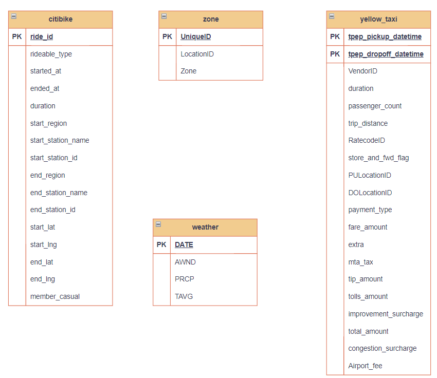
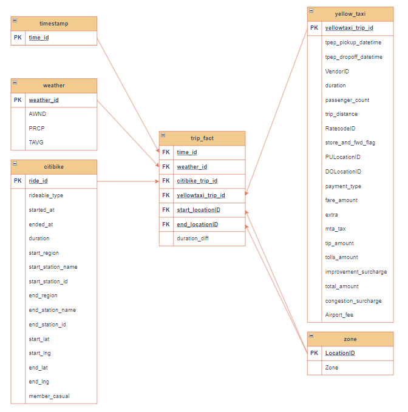
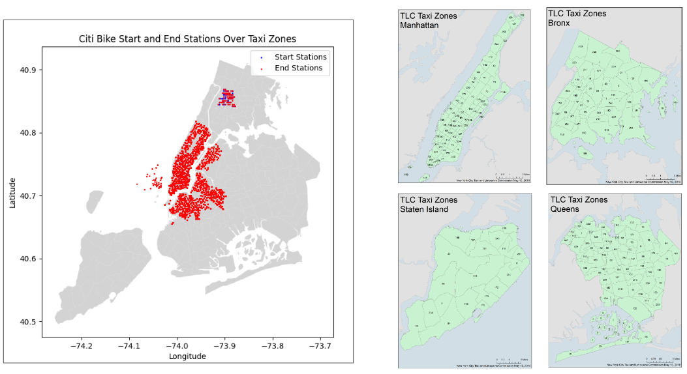

# NYC Transportation ETL Pipeline

Building an ETL pipeline using Snowflake Tasks by first loading files to the Stage and then processing & populating tables through stored procedures.

## Acknowledgements

 - [NYC Transportation ETL Pipeline](https://github.com/Siyu-Wu/NYC-Transportation-ETL-Pipeline)
 - [Code accompanying Chapter 14 of the book Data Pipelines with Apache Airflow](https://github.com/BasPH/data-pipelines-with-apache-airflow/tree/master/chapter14)
 - [Data Pipelines with Apache Airflow](https://github.com/matiassingers/awesome-readme)
 - [TLC Trip Record Data](https://www.nyc.gov/site/tlc/about/tlc-trip-record-data.page)
 - [Citi Bike Trip Histories](https://citibikenyc.com/system-data)
 - [NOAA - NYC Weather History](https://www.ncdc.noaa.gov/cdo-web/search)
 - [CityBikes API](https://api.citybik.es/v2/)

## Roadmap

- Get files with different formats (.zip, .csv, .parqiet) and PUT them to Snowflake Stage.

- Create Table Schemas within Snowflake datawarehouse.

- Process files in the Snowflake Stage and insert/update values in tables.

- Construct a Data Mart with a Star Schema within the Snowflake environment.

## Data Management

## Screenshots

